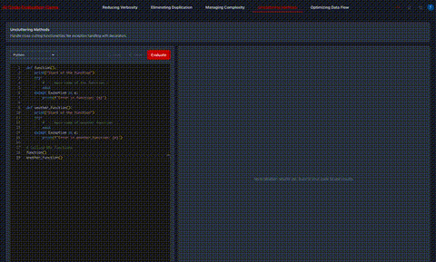

# AI Code Evaluation Game

A modern web application for coding challenges with real-time AI evaluation using GPT-4. Built with Next.js, TypeScript, and Chakra UI.



## Features

### Core Functionality
- 🎯 Multiple coding challenges with varying difficulty levels
- 🤖 Real-time code evaluation using Azure OpenAI GPT-4
- 💻 Syntax-highlighted code editor with language support
- 🌓 Dark/Light mode support
- 📱 Responsive design for all devices

### Editor Features
- 🔍 Multiple programming language support
- 📋 Copy/Paste functionality
- 🧹 Clear editor with confirmation
- ⌨️ Keyboard shortcuts
- 🔄 Auto-save support

### Evaluation System
- ✅ Clear Pass/Fail/Warning status indicators
- 📝 Detailed feedback from AI
- 📊 Evaluation history
- 🔄 Rate-limited API calls
- 🚫 Error handling

### UI/UX
- 📱 Mobile-friendly interface
- 🎨 Clean, modern design
- 🔄 Smooth transitions and animations
- 💾 Persistent settings
- 🏷️ Challenge difficulty badges

## Getting Started

### Prerequisites
- Node.js 16+ (18.x.x recommended)
- npm or yarn
- Azure OpenAI API key
- Supabase account and project
- Clerk account for authentication

### Installation

1. Clone the repository:

```bash
git clone git@github.com:copocaneta/code-evaluation-platform.git
cd code-evaluation-platform
```

2. Install dependencies:

```bash
npm install
# or
yarn install
```

3. Create a `.env.local` file with all required variables:

```env
# OpenAI Configuration
OPENAI_API_KEY=your_azure_openai_api_key
AZURE_OPENAI_ENDPOINT=https://your-endpoint.openai.azure.com
AZURE_OPENAI_DEPLOYMENT=deployment-name
AZURE_OPENAI_API_VERSION=2024-02-15-preview

# Supabase Configuration
NEXT_PUBLIC_SUPABASE_URL=your_supabase_project_url
NEXT_PUBLIC_SUPABASE_ANON_KEY=your_supabase_anon_key

# Clerk Authentication
NEXT_PUBLIC_CLERK_PUBLISHABLE_KEY=your_clerk_publishable_key
CLERK_SECRET_KEY=your_clerk_secret_key

# Application Configuration
NEXT_PUBLIC_APP_NAME="AI Code Evaluation Game"
NODE_ENV=development

# Rate Limiting Configuration
RATE_LIMIT_CAPACITY=10
RATE_LIMIT_REFILL_RATE=0.1
RATE_LIMIT_REFILL_TIME=10
```

4. Set up the database:

```sql
-- Create the leaderboard table
CREATE TABLE leaderboard (
  user_id TEXT PRIMARY KEY,
  username TEXT NOT NULL,
  points INTEGER DEFAULT 0,
  avatar_url TEXT,
  updated_at TIMESTAMP WITH TIME ZONE DEFAULT NOW()
);

-- Create the completed_challenges table
CREATE TABLE completed_challenges (
  user_id TEXT,
  challenge_id TEXT,
  completed_at TIMESTAMP WITH TIME ZONE DEFAULT NOW(),
  PRIMARY KEY (user_id, challenge_id)
);

-- Create indexes for better query performance
CREATE INDEX idx_leaderboard_points ON leaderboard(points DESC);
CREATE INDEX idx_completed_challenges_user ON completed_challenges(user_id);
CREATE INDEX idx_completed_challenges_challenge ON completed_challenges(challenge_id);
```

5. Run the development server:

```bash
npm run dev
# or
yarn dev
```

### Installation Troubleshooting

#### Common Issues and Solutions

1. **Node.js Version Conflicts**
   - Use nvm to manage Node.js versions
   - Ensure you're using Node.js 16+ (18.x.x recommended)
   ```bash
   nvm install 18
   nvm use 18
   ```

2. **Supabase Connection Issues**
   - Verify your Supabase project is active
   - Check if the anon key has the correct permissions
   - Ensure tables are created with proper schemas

3. **Clerk Authentication Problems**
   - Verify your Clerk application settings
   - Check if redirect URLs are properly configured
   - Ensure all required environment variables are set

4. **OpenAI API Issues**
   - Verify your API key is valid
   - Check if you have sufficient API credits
   - Ensure proper API version is specified

## Usage

1. **Select a Challenge**
   - Choose from different difficulty levels
   - Read the challenge description
   - View challenge requirements

2. **Write Code**
   - Select your preferred programming language
   - Write or paste your solution
   - Use keyboard shortcuts for common actions

3. **Evaluate**
   - Click "Evaluate" or use the shortcut
   - View AI feedback in real-time
   - See Pass/Fail status

4. **Review History**
   - View previous evaluations
   - Track your progress
   - Learn from feedback

## System Architecture

### Evaluation System

#### JSON Structures

1. **Evaluation Result**
```typescript
interface EvaluationResult {
  id: string;          // Unique identifier for the evaluation
  timestamp: string;   // When the evaluation was performed
  status: 'success' | 'error' | 'warning';  // Evaluation outcome
  content: string;     // Detailed feedback from AI
}
```

2. **Challenge Completion**
```typescript
interface CompletedChallenge {
  user_id: string;     // Clerk user ID
  challenge_id: string; // Challenge identifier
  completed_at: string; // Completion timestamp
}
```

#### Evaluation Flow

1. **Code Submission**
   - User submits code through the editor
   - System checks if challenge was already completed
   - If not completed, proceeds with evaluation

2. **AI Evaluation Process**
   - Two-phase evaluation using GPT-4:
     1. Detailed Analysis: Provides comprehensive feedback
     2. Pass/Fail Check: Binary success determination
   - Rate limiting: 3 requests per 10 seconds
   - Evaluation criteria based on challenge requirements

3. **Result Processing**
   - Success: 
     - Awards points
     - Marks challenge as completed
     - Updates leaderboard
   - Failure: 
     - Provides constructive feedback
     - Allows retry
   - Already Completed:
     - Prevents resubmission
     - Guides to next challenge

### Scoring System

1. **Points Structure**
   - 10 points per successful challenge completion
   - Points are awarded only once per challenge
   - No partial points for attempts

2. **Leaderboard System**
```typescript
interface LeaderboardEntry {
  userId: string;      // User identifier
  username: string;    // Display name
  points: number;      // Total accumulated points
  avatarUrl?: string;  // Optional avatar
}
```

#### Leaderboard Features
- Real-time point tracking
- Top 100 users displayed
- Points persist across sessions
- Automatic updates on success

### Database Schema

#### Tables

1. **leaderboard**
```sql
CREATE TABLE leaderboard (
  user_id TEXT PRIMARY KEY,
  username TEXT NOT NULL,
  points INTEGER DEFAULT 0,
  avatar_url TEXT,
  updated_at TIMESTAMP WITH TIME ZONE
);
```

2. **completed_challenges**
```sql
CREATE TABLE completed_challenges (
  user_id TEXT,
  challenge_id TEXT,
  completed_at TIMESTAMP WITH TIME ZONE,
  PRIMARY KEY (user_id, challenge_id)
);
```

### Authentication System
- Clerk authentication integration
- User session management
- Secure user identification
- Profile management

### Rate Limiting
- Token bucket algorithm implementation
- 3 requests per 10 seconds per user
- Automatic token refill
- Graceful handling of limit exceeding

## API Documentation

### Endpoints

1. **/api/evaluate**
   - Method: POST
   - Purpose: Evaluate submitted code
   - Rate Limited: Yes (3 requests/10s)
   ```typescript
   // Request
   {
     code: string;
     language: string;
     challengeId: string;
     systemPrompt: string;
   }
   
   // Response
   {
     id: string;
     timestamp: string;
     status: 'success' | 'error' | 'warning';
     content: string;
   }
   ```

2. **/api/points**
   - Method: POST
   - Purpose: Award points for successful challenges
   ```typescript
   // Request
   {
     points: number;
   }
   
   // Response
   {
     points: number; // Updated total points
   }
   ```

### Error Codes
- 400: Bad Request (Missing required fields)
- 401: Unauthorized (Not authenticated)
- 409: Conflict (Challenge already completed)
- 429: Too Many Requests (Rate limit exceeded)
- 500: Internal Server Error

## Deployment

### Vercel Deployment
1. Fork the repository
2. Create a new project in Vercel
3. Connect to your GitHub repository
4. Configure environment variables
5. Deploy

### Self-Hosted Deployment
1. Build the application
   ```bash
   npm run build
   ```
2. Set up environment variables
3. Configure reverse proxy (nginx recommended)
4. Set up PM2 for process management
   ```bash
   pm2 start npm --name "ai-code-game" -- start
   ```

### Production Considerations
- Enable error monitoring (e.g., Sentry)
- Set up logging aggregation
- Configure proper CORS settings
- Implement backup strategy for database
- Set up health checks

## Tech Stack

- **Frontend**: Next.js 14, TypeScript, Chakra UI
- **State Management**: Zustand
- **Code Editor**: Monaco Editor
- **AI**: Azure OpenAI GPT-4
- **Styling**: Chakra UI, Emotion
- **API**: Next.js API Routes

## Project Structure

```
src/
├── components/        # React components
├── pages/            # Next.js pages
├── store/            # Zustand state management
├── services/         # API services
├── types/            # TypeScript types
├── hooks/            # Custom React hooks
├── utils/            # Utility functions
├── data/            # Static data
└── middleware/       # API middleware
```

## Contributing

1. Fork the repository
2. Create your feature branch (`git checkout -b feature/amazing-feature`)
3. Commit your changes (`git commit -m 'Add amazing feature'`)
4. Push to the branch (`git push origin feature/amazing-feature`)
5. Open a Pull Request

## License

This project is licensed under the MIT License - see the LICENSE file for details.

## Acknowledgments

- Azure OpenAI for the GPT-4 API
- Next.js team for the amazing framework
- Chakra UI for the component library
- Monaco Editor team for the code editor

## Technical Details

### AI Evaluation System
The platform uses a dual-call approach to GPT-4 for code evaluation:
1. **Detailed Evaluation Call**: Gets comprehensive feedback about the code
2. **Status Validation Call**: Makes a separate call specifically for PASS/FAIL determination
   ```typescript
   // First call for detailed feedback
   const evaluationResponse = await makeOpenAIRequest(
     systemPrompt,
     `Please evaluate this ${language} code:\n\n${code}`
   );

   // Second call for status
   const statusResponse = await makeOpenAIRequest(
     "You are a code validator. Respond with ONLY 'PASS' or 'FAIL'.",
     `Does this code meet the requirements?...`
   );
   ```

### Rate Limiting
Implements a token bucket algorithm for API rate limiting:
```typescript
class RateLimiter {
  private tokens: number;
  private lastRefill: number;
  private refillRate: number;
  private capacity: number;

  constructor(capacity: number, refillRate: number) {
    this.tokens = capacity;
    this.capacity = capacity;
    this.refillRate = refillRate;
    this.lastRefill = Date.now();
  }

  async check(res: NextApiResponse, cost: number, period: string): Promise<boolean> {
    // Refills tokens based on time passed
    const now = Date.now();
    const timePassed = now - this.lastRefill;
    this.tokens = Math.min(this.capacity, this.tokens + timePassed * this.refillRate);
    this.lastRefill = now;

    if (this.tokens < cost) {
      return false; // Rate limit exceeded
    }

    this.tokens -= cost;
    return true;
  }
}
```

### State Management
Uses Zustand for efficient state management with multiple stores:

1. **Challenge Store**
```typescript
interface ChallengeStore {
  challenges: Challenge[];
  activeChallenge: Challenge | null;
  setActiveChallenge: (challengeId: string) => void;
  loadChallenges: () => void;
}
```

2. **Editor Store**
```typescript
interface EditorStore {
  code: string;
  language: string;
  setCode: (code: string) => void;
  setLanguage: (language: string) => void;
  clearEditor: () => void;
}
```

3. **Evaluation Store**
```typescript
interface EvaluationStore {
  results: EvaluationResult[];
  isLoading: boolean;
  error: string | null;
  addResult: (result: EvaluationResult) => void;
  clearResults: () => void;
}
```

### Code Editor Integration
- Uses Monaco Editor with custom configuration
- Supports multiple languages
- Implements keyboard shortcuts
```typescript
const editorOptions: EditorProps['options'] = {
  minimap: { enabled: editor.showMinimap },
  fontSize: theme.fontSize,
  fontFamily: editor.fontFamily,
  fontLigatures: editor.fontFamily.includes('Fira Code'),
  tabSize: editor.tabSize,
  wordWrap: editor.lineWrapping ? 'on' : 'off',
  lineNumbers: editor.showLineNumbers ? 'on' : 'off',
};
```

### API Architecture
- Next.js API routes for backend functionality
- Azure OpenAI integration with error handling
- Rate limiting middleware
```typescript
export default async function handler(req: NextApiRequest, res: NextApiResponse) {
  if (req.method !== 'POST') {
    return res.status(405).json({ message: 'Method not allowed' });
  }

  try {
    await rateLimiter.check(res, 3, '10 s');
    // ... API logic
  } catch (error) {
    res.status(500).json({ message: 'Internal server error' });
  }
}
```

### Markdown Rendering
Custom markdown renderer with syntax highlighting:
```typescript
const components: Components = {
  code({ children, className, node, ...props }) {
    const isInline = !className;
    if (isInline) {
      return <code {...props}>{children}</code>;
    }
    // Block code rendering with syntax highlighting
    return <SyntaxHighlighter language={language} style={theme}>{children}</SyntaxHighlighter>;
  }
};
```

### Type Safety
- Comprehensive TypeScript types for all components
- Strict type checking enabled
- Custom type definitions for external libraries

### Performance Optimizations
- Code splitting with Next.js
- Efficient state updates with Zustand
- Debounced editor updates
- Memoized components where beneficial

### Security Features
- API rate limiting
- Input sanitization
- Environment variable protection
- Secure API key handling

### Error Handling
- Graceful degradation
- User-friendly error messages
- Comprehensive error logging
- Recovery mechanisms

### Testing Considerations
- Component isolation
- State management testing
- API integration testing
- Error scenario coverage

## Development Guidelines

### Code Style
- Consistent formatting with Prettier
- ESLint rules enforcement
- Component organization patterns
- State management patterns

### Best Practices
- Component composition
- State isolation
- Error boundary implementation
- Performance monitoring

### Deployment
- Environment configuration
- Build optimization
- Monitoring setup
- Error tracking
